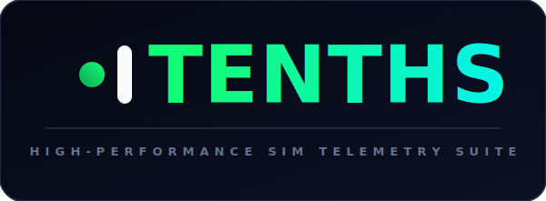
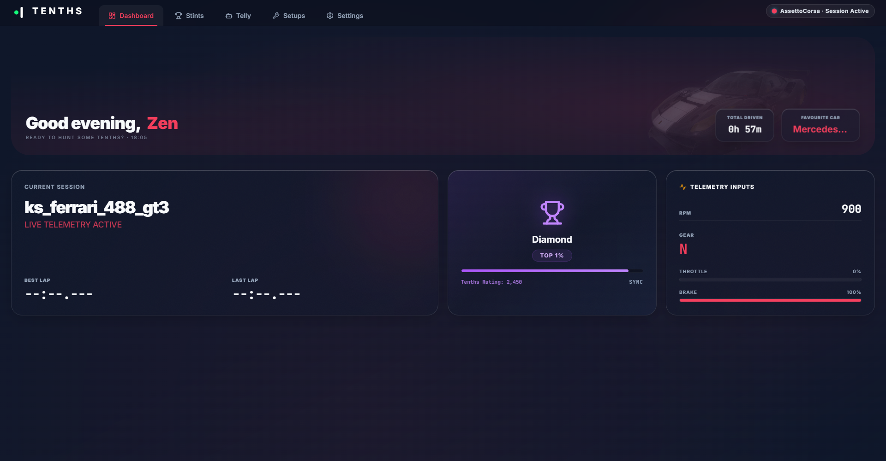
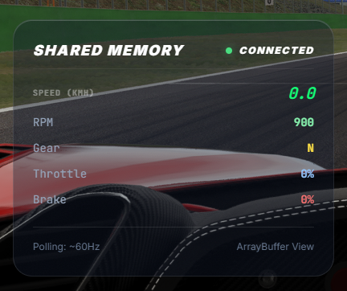
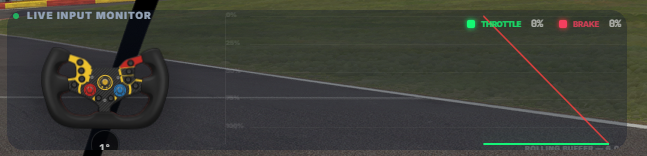
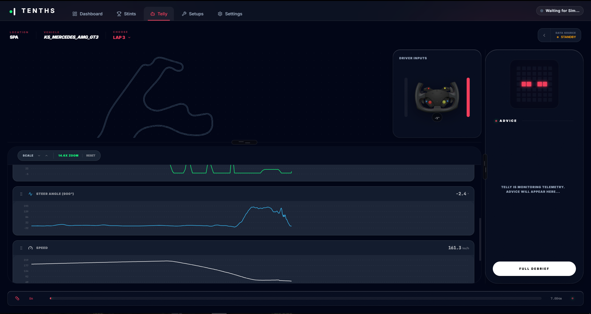
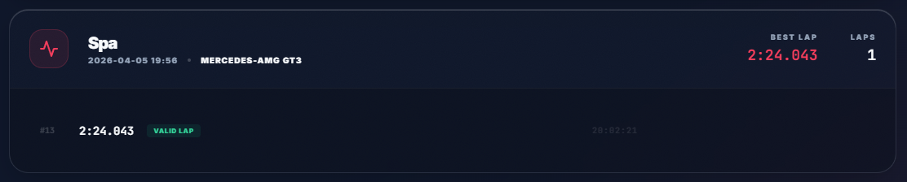
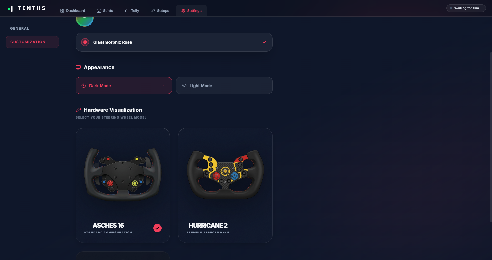

  

> **Proprietary & Closed-Source Product Showcase**
> 
> *Tenths is a commercial-grade, closed-source telemetry and real-time visualization suite designed for competitive sim racing. This repository serves as an architectural documentation and feature showcase for software engineering and systems design.*

## 🛠️ System Architecture & Engineering Highlights

Tenths is engineered with a hybrid desktop/web architecture that separates low-latency system-level data capture from rich, interactive telemetry visualizations. The application is divided into two primary runtime components:

*   **Tenths Hub (Host Control Panel):** A .NET desktop client that hosts the React dashboard inside a high-performance, containerized WebView2 instance. The Hub serves as the telemetry inspector, historical stint database manager, and interface for the AI Race Engineer ("Telly").
*   **Tenths Overlay (Transparent HUD):** A dedicated, transparent, hardware-accelerated WPF window that projects real-time telemetry inputs (throttle, brake, steering angle, speed) directly on top of the active simulator window without stealing window focus.

---
### 1. Zero-Copy IPC Transport
Rather than relying on high-overhead JSON serialization, local WebSockets, or HTTP polling, Tenths leverages **WebView2 Shared Memory Buffers**.
* **Zero-Allocation Data Pipeline:** The C# desktop host initializes a `1MB` shared memory block (`CoreWebView2SharedBuffer`) and posts it directly to the React frontend process.
* **Direct Memory Mapping:** In the C# telemetry loop, raw simulator frame structs are written straight to the unmanaged memory pointer via `Buffer.MemoryCopy`.
* **ArrayBuffer Reading:** The TypeScript frontend maps the shared memory space directly into a read-only `ArrayBuffer`, decoding the binary stream at **60Hz** with virtually zero CPU overhead.
---
### 2. Reverse-Engineered Archive Decryption (`.acd`)
Simulators like Assetto Corsa ship encrypted vehicle physics profiles inside proprietary `.acd` archive files. To extract telemetry-critical parameters (such as `STEER_LOCK`) dynamically without hardcoded fallbacks, the platform includes a custom decryption utility.

---
### 3. Spatial Decimation & Vector Mapping
To generate track layouts without heavy external map services:
* **AI Line Parser:** Extracts track boundaries and spline coordinates from simulator-generated files (`fast_lane.ai`).
* **Spatial Decimation:** A coordinate filtering algorithm processes telemetry frames to downsample thousands of coordinate updates into lightweight Protobuf-serialized vector track splines (`track_map.proto`), which are then rendered as native SVGs on the frontend.

## 📺 Feature Tour & Screenshots

### 1. Dynamic telemetry dashboard
The central hub provides an immediate status report of the active simulator connection, session state, user driver ranking, and raw real-time dashboard stats.

---
### 2. High-Performance HUD & Overlay System
Tenths projects a transparent overlay window directly on top of the simulator. It renders custom transparent widgets to keep critical information in the driver's peripheral vision.

<table>
  <tr>
    <td width="40%">
      
<b>Shared Memory HUD</b>

      
      
<i>Low-latency display of physical simulator values including RPM, gears, and live speed.</i>

    </td>
    <td width="60%">
      
<b>Live Input Monitor</b>

      
      
<i>Interactive steering wheel angle visualization and scrolling input charts.</i>

    </td>
  </tr>
</table>

---

### 3. AI Race Engineer ("Telly") & Analytics Console
The telemetry inspection suite features **Telly**, an AI-driven race engineering console. 

* *Telly tracks driver inputs—analyzing throttle response, brake applications, and steering angle profiles against a reference lap.*
* *The UI renders the decrypted track outline dynamically, plotting live GPS traces and rendering interactive wheel rotational angles alongside speed graphs.*
* *The advice engine provides real-time driver coaching based on stint consistency.*
---
### 4. Data Persistence & Stint History
Lap data is written to a local database to build a permanent performance log.

* *The local persistence layer is managed using a high-performance **SQLite** instance accessed via **Dapper ORM**.*
* *Database schemas use optimized indexes covering (`track_id`, `car_id`, `lap_time_ms`) to return fast query results for historical stints and best-lap lookups.*
---
### 5. Hardware Visualization & Customization
Drivers can customize their telemetry layouts, switch between high-contrast dark themes, and configure their exact steering wheel hardware profiles.

* *Supports native hardware graphics (e.g. Asches 16 and Hurricane 2) to match the telemetry input monitor with the user's physical steering wheel.*

---
### 6. Roadmap

### - [ ] Implement numerical and generative analysis of telemetry
### - [ ] Implement online leaderboards, including user accounts 
### - [ ] Fix remaining faulty metric recording, including race line

---

  Designed & Engineered by Zen. Built for Sim Racers.

